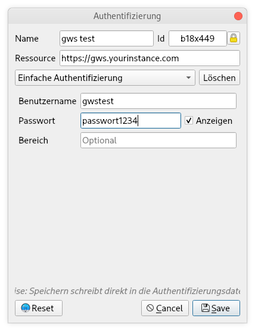

ALKIS-Geocoder
==============

Geokodierung von Adressdaten auf Basis von ALKIS
------------------------------------------------

Dieses Plugin ermöglicht die Geokodierungen von Adressdaten (Ort, Straße und Hausnummer) auf Basis von Daten des Amtlichen Liegenschaftskatasterinformationssystems [ALKIS](https://de.wikipedia.org/wiki/Amtliches_Liegenschaftskatasterinformationssystem). Voraussetzung ist, dass ein Nutzeraccount zu einer [GBD WebSuite](https://gws.gbd-consult.de) vorhanden ist, deren [alkisgeocoder Schnittstelle](https://gws.gbd-consult.de/doc/current/books/server-admin/en/actions.html) aktiv ist und das [ALKIS Modul](https://gws.gbd-consult.de/doc/current/books/client-user/de/sidebar/cadastral_unit_searching.html) genutzt wird, um Liegenschaftsdaten zu verwalten, abzufragen und zur Verfügung zu stellen. 

Liegenschaftsinformationen (ALKIS) bieten zwar nicht denselben Informationsgehalt einer Adressdatenbank. Wenn ALKIS Daten vorhanden sind, ist es denoch möglich, diese zu nutzen, um Adressdaten zu geokodieren und somit als Punkte in einer Karte zu verorten.

Installation
------------

Das Plugin wird über das [Plugin Repository der Geoinformatikbüro Dassau GmbH](https://plugins.gbd-consult.de) bereitgestellt. Sie können das Repository über den QGIS Pluginmanager einbinden.

Das Plugin kann über das Menü Erweiterungen -> GBD ALKIS Geocoder geladen werden.

Bedienung
---------
Wenn Sie das GBD ALKIS Geocoder Plugin in QGIS geladen und geöffnet haben, finden Sie folgendes Fenster vor:

Da das Plugin das [Authentifizierungssystem 🔐](https://docs.qgis.org/3.10/de/docs/user_manual/auth_system/auth_overview.html) von QGIS verwendet, kann es sein, dass beim erstmaligen starten ein Hauptkennwort vergeben werden muss.

Dies ist nur der Fall, wenn das Authentifizierungssystem nicht bereits für andere Zugangsdaten verwendet wurde.

Anschließend kann über das grüne Plus Symbol ein neuer Authentifizierungsdatensatz erstellt werden.
Sie können hier aber auch ihre bereits vorhandene GWS-Verbindung auswählen.

Wichtig ist, dass Sie als Authentifizierungsart *Einfache Authentifizierung* auswählen und bei Quelle die URL der GWS-Instanz angeben.

Anschließend muss die Auswahl einer in QGIS bereits geladenen Tabelle (z.B. Excel, CSV oder OpenOffice Tabelle (.ods)) mit Adressdaten erfolgen. Ort, Straße und Hausnummer müssen in einer eigenen Spalte abgelegt sein.

Jetzt weisen Sie die Spalten Gemarkung (Ort), Straße und Hausnummer manuell zu. Über den Button 'Layer generieren' starten Sie die Geokodierung. Ein neuer temporärer Punktlayer mit lat und lon werten wird erstellt und direkt in das QGIS Layerfenster geladen. Die zugewiesenen Punktkoordinaten werden in zwei neue Spalten zu den Werte der Ausgangstabelle ergänzt.

## Lizenz

Dieses Programm ist freie Software. Es kann unter der den Bedingungen der [GNU General Public License](./LICENSE) weitergegeben und/oder verändert werden. Entweder unter der Version 2 oder einer späteren Version der GPL.
